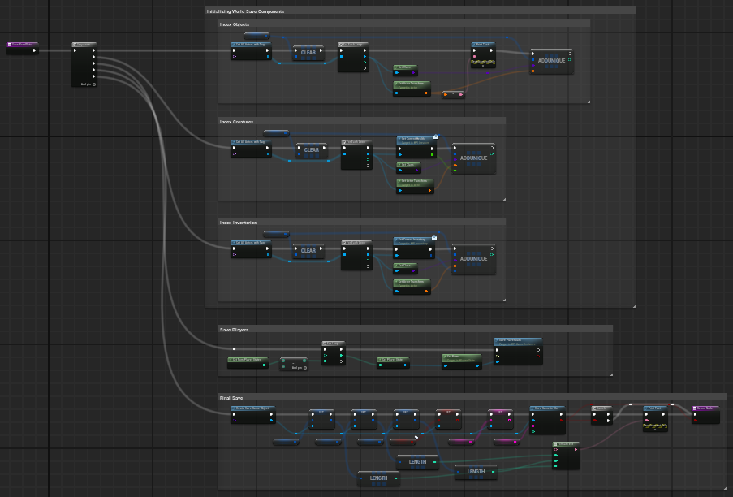

<h1>Let's make a game!</h1>

 ### [YouTube Demonstration](https://youtu.be/7eJexJVCqJo)

<h2>Description</h2>
This is a multiplayer survival game I am making with a group of three others. We are aiming for gameplay similar to the forest with an early 2000's look.
<br />


<h2>Languages and Utilities Used</h2>

- <b>PowerShell</b> 
- <b>Diskpart</b>

<h2>Environments Used </h2>

- <b>Windows 10/11</b> (21H2)

<h2>Program walk-through:</h2>

<p align="center">
Creating save logic: <br/>

<br />
<br />
Creating daylight cycle:  <br/>

</p>

<!--
 ```diff
- text in red
+ text in green
! text in orange
# text in gray
@@ text in purple (and bold)@@
```
--!>
